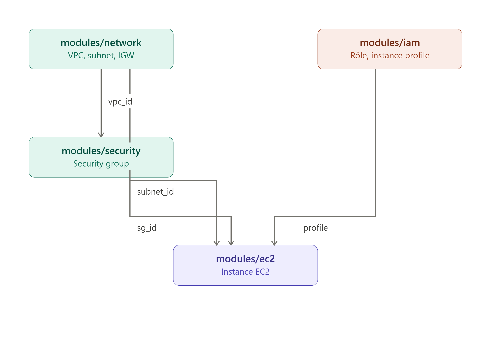

Voici un exemple concret complet, avec structure de repo, code Terraform, et pipeline GitHub Actions.

## Structure du repo

```
aws-infra/
├── .github/
│   └── workflows/
│       └── terraform.yml
├── modules/
│   ├── network/
│   │   ├── main.tf
│   │   ├── variables.tf
│   │   └── outputs.tf
│   ├── security/
│   │   ├── main.tf
│   │   └── variables.tf
│   ├── ec2/
│   │   ├── main.tf
│   │   └── variables.tf
│   └── iam/
│       ├── main.tf
│       └── outputs.tf
├── envs/
│   ├── dev/
│   │   ├── main.tf
│   │   ├── backend.tf
│   │   └── terraform.tfvars
│   └── prod/
│       ├── main.tf
│       ├── backend.tf
│       └── terraform.tfvars
└── README.md
```





## 1. Module réseau (VPC, IGW, Subnet)

**modules/network/main.tf**

**modules/network/variables.tf**

**modules/network/outputs.tf**


## 2. Module Security Group

**modules/security/main.tf**

**modules/security/variables.tf**


## 3. Module IAM (rôle + instance profile pour l'EC2)

**modules/iam/main.tf**

**modules/iam/outputs.tf**


## 4. Module EC2

**modules/ec2/main.tf**

**modules/ec2/variables.tf**


## 5. Environnement dev — assemblage des modules

**envs/dev/backend.tf**

**envs/dev/main.tf**

**envs/dev/terraform.tfvars**


## 6. Pipeline GitHub Actions avec OIDC (sans clés statiques)

D'abord, créer le rôle IAM côté AWS qui fait confiance à GitHub OIDC (à faire une fois, manuellement ou via un bootstrap Terraform séparé) :

```hcl
resource "aws_iam_openid_connect_provider" "github" {
  url             = "https://token.actions.githubusercontent.com"
  client_id_list  = ["sts.amazonaws.com"]
  thumbprint_list = ["6938fd4d98bab03faadb97b34396831e3780aea1"]
}

resource "aws_iam_role" "github_actions" {
  name = "github-actions-terraform"
  assume_role_policy = jsonencode({
    Version = "2012-10-17"
    Statement = [{
      Effect = "Allow"
      Principal = { Federated = aws_iam_openid_connect_provider.github.arn }
      Action = "sts:AssumeRoleWithWebIdentity"
      Condition = {
        StringEquals = {
          "token.actions.githubusercontent.com:aud" = "sts.amazonaws.com"
        }
        StringLike = {
          "token.actions.githubusercontent.com:sub" = "repo:monorg/aws-infra:*"
        }
      }
    }]
  })
}
```

**.github/workflows/terraform.yml**

## Points clés du workflow

- **PR ouverte** → job `plan` s'exécute, poste le plan en commentaire pour revue humaine
- **Merge sur `main`** → job `apply` se déclenche, protégé par un `environment` GitHub (tu peux exiger une approbation manuelle dans Settings → Environments → dev → Required reviewers)
- **Pas de clés AWS stockées** : le rôle est assumé via OIDC, donc pas de secret `AWS_ACCESS_KEY_ID` à gérer
- **State centralisé** dans S3 avec lock DynamoDB pour éviter les conflits si plusieurs runs en parallèle
- Pour la **prod**, on dupliquerait ce job avec un `environment: prod` ayant des reviewers obligatoires et potentiellement un déclenchement manuel (`workflow_dispatch`) plutôt qu'automatique sur push
